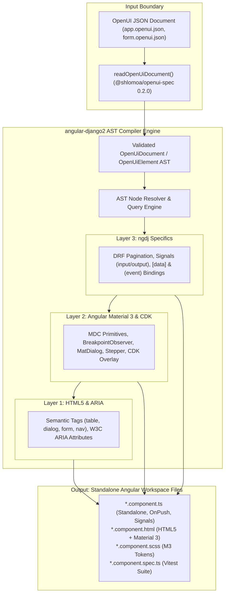

# Execution Plan: Converting Schematic-Specific Schemas to OpenUI AST

This document establishes the detailed, enumerated execution plan to transition `angular-django2` (`ngdj`) from CLI option-bag and schematic-specific schemas to a **document-driven, JSON-first compiler** consuming the canonical OpenUI AST (`OpenUiDocument`, `OpenUiElement`).

---

## 1. Architectural Purpose and Background

### 1.1 The Problem: Fragmented, Schematic-Specific Schemas

Currently, `angular-django2` public schematics published in [`projects/angular-django2/schematics/collection.json`](../projects/angular-django2/schematics/collection.json) are driven by individual Angular DevKit JSON schemas (`schema.json`). This model has several critical limitations:

1. **Proprietary Embedded Document Schemas**:
   - `reactive-form` relies on an ad-hoc JSON contract defined under `definitions/reactiveFormDefinition` in [`projects/angular-django2/schematics/reactive-form/schema.json`](../projects/angular-django2/schematics/reactive-form/schema.json). It defines custom structures for fields, controls, validators, and backend endpoints that duplicate concepts standardized in OpenUI.
   - `workspace-setup` relies on `definitions/fileHook` in [`projects/angular-django2/schematics/workspace-setup/schema.json`](../projects/angular-django2/schematics/workspace-setup/schema.json).
2. **Disjoint CLI Option Bags**:
   - Component, page, and application schematics take fragmented CLI flags (e.g. `--controlType`, `--appearance`, `--subscriptSizing` for `form-field`; `--routePath`, `--access`, `--authGuard`, `--navigationLabel`, `--navigationIcon` for `page`; `--features`, `--mode` for `complex-component`).
   - These flags cannot describe nested UI hierarchies, multi-component layout slots, or cross-component event bindings in a single, verifiable format.
3. **Impedance Mismatch with Upstream Orchestration**:
   - External orchestrators (such as `django-angular3` / `djng`) and UI designers produce technology-independent OpenUI documents. Requiring orchestration to break an OpenUI document into dozens of CLI commands with custom arguments creates friction, parser drift, and brittle generation scripts.

### 1.2 The Target: Document-Driven JSON-First Compiler (Option A)

As specified in [`docs/openui-spec-implementation-plan.md`](openui-spec-implementation-plan.md):

- `angular-django2` operates as a deterministic compiler consuming canonical OpenUI AST documents.
- The document parsing and validation utility [`readOpenUiDocument()`](../projects/angular-django2/schematics/utility/openui.ts) is already implemented and validated by unit tests in [`projects/angular-django-validation/unit/schematics/schematics.openui.spec.ts`](../projects/angular-django-validation/unit/schematics/schematics.openui.spec.ts).
- This plan establishes the phased roadmap to convert all schematic-specific input schemas to consume and compile directly from the OpenUI AST.

### 1.3 Repository Ownership Boundary (Issue #27)

- **`openui-spec` Authority**: Owns the specification grammar, JSON Schema (`openui.schema.json`), vocabulary catalog (`openui.json`), and the canonical TypeScript parser/validator library (`@shlomoa/openui-spec`).
- **`angular-django2` Authority**: Owns its public schematic contracts, deterministic Three-Layer code generation (Layer 1: HTML5/ARIA, Layer 2: Material 3/CDK, Layer 3: Signals/DRF), and Angular workspace files.
- **`django-angular3` (`djng`) Authority**: Owns Django-side artifact selection, canonical OpenUI-to-schematic mapping, wrappers, orchestration, stage gating, and final generated-app acceptance.



---

## 2. Schematic Inventory and Conversion Matrix

Every schematic currently published in [`projects/angular-django2/schematics/collection.json`](../projects/angular-django2/schematics/collection.json) is mapped to its OpenUI 0.2.0 AST counterpart:

| Schematic                                             | Current Input Contract                                                                      | Current Schema Limitation                                           | Target OpenUI AST Representation (0.2.0)                                                               | Conversion Strategy                                                                                             |
| :---------------------------------------------------- | :------------------------------------------------------------------------------------------ | :------------------------------------------------------------------ | :----------------------------------------------------------------------------------------------------- | :-------------------------------------------------------------------------------------------------------------- |
| **`reactive-form`**                                   | `--definition=<path>` pointing to `reactiveFormDefinition`                                  | Bespoke proprietary JSON schema with custom field/validator objects | `views/form` (`id: form`, `type: Form`) with child `controls` and validation attributes                | **Direct Replacement**: Deprecate `reactiveFormDefinition`; compile directly from `Form` AST subtree            |
| **`form-field`**                                      | `--controlType`, `--appearance`, `--subscriptSizing`                                        | Flat CLI flags for control kind and Material attributes             | `controls/textInputs`, `rangeControl`, `choiceControls`, `pickerControl`                               | **AST Leaf Compiler**: Accepts `--document` + `--nodeId` pointing to control AST node                           |
| **`field-component`**                                 | `--kind` (text, email, password, textarea)                                                  | Convenience CLI wrapper over `form-field`                           | Leaf control primitive AST nodes                                                                       | **AST Leaf Compiler**: Derives configuration from control node properties                                       |
| **`page`**                                            | `--name`, `--routePath`, `--access`, `--authGuard`, `--navigationLabel`, `--navigationIcon` | CLI option bag mixing routing, security, and navigation metadata    | `pages/dashboard`, `pages/emptyPage`, `pages/shellPage`, or routed page AST nodes                      | **Page AST Compiler**: Maps OpenUI page identity, title, navigation, and nested containers to route & component |
| **`component`**                                       | `--name`, `--path`, `--standalone`, `--changeDetection`                                     | Basic Angular CLI generator with embedding hooks                    | `containers/surfaceContainers` (`id: surfaceContainers`)                                               | **Container AST Compiler**: Generates container component from surface container AST node                       |
| **`complex-component`**                               | `--name`, `--features` (mixins, nested, projection, cdk-overlay), `--mode`                  | String-based feature flag list                                      | Composite container AST with nested child slots or overlay containers                                  | **Composite AST Compiler**: Generates component hierarchy driven by AST child elements                          |
| **`embed-component`**                                 | `--component`, `--parent`, `--selector`, `--inputs`, `--outputs`                            | Manual wiring of parent/child via CLI arguments                     | AST Tree Hierarchy (`parent.children = [child]`)                                                       | **AST Composition Engine**: Automated child injection at parent embedding hooks during recursive compilation    |
| **`material-app`**                                    | `--name`, `--theme`, `--typography`, `--animations`, `--routing`, `--zoneless`              | Monolithic application flags                                        | `application` root element + `navigation` shell + `presentation` tokens                                | **App Shell Compiler**: Compiles root OpenUI application document into workspace shell                          |
| **`application`**                                     | `--name`, `--routing`, `--standalone`, `--ssr`, `--zoneless`, `--style`                     | CLI application generator options                                   | `application` root element                                                                             | **Base App Compiler**: Standard OpenUI app structure without Material extras                                    |
| **`app-shell`**                                       | `--project`                                                                                 | CLI project identifier                                              | `pages/shellPage` AST element                                                                          | **Shell Compiler**: SSR/prerender shell mapped to `shellPage`                                                   |
| **`material-setup`**                                  | `--project`, `--theme`, `--typography`, `--animations`                                      | Workspace styling flags                                             | `presentation` (color, typography, visual states)                                                      | **Presentation Compiler**: Configures global theme tokens from OpenUI presentation model                        |
| **`workspace-setup`**                                 | `--name`, `--files` pointing to `fileHook`                                                  | Custom per-file content/template hooks                              | OpenUI static host assets (`indexHtml`, `favicon`) + workspace bootstrap                               | **Workspace Compiler**: Ingests host document assets from OpenUI root metadata                                  |
| **`data-service`**                                    | `--name`, `--apiService`, `--apiPath`, `--flat`, `--skipTests`                              | CLI flags pointing to OpenAPI artifacts                             | `[data]`, `(sort)`, `(filter)`, `(paginate)` bindings in `widgets` and `views/report`                  | **Data Binding Compiler**: Ingests endpoint bindings from AST to generate typed service bridge                  |
| **`openapi-setup`**                                   | `--outputPath`, `--openapiSpecFile`, `--helpersPath`                                        | CLI setup paths for external tool `ng-openapi-gen`                  | External contract configuration                                                                        | **Infrastructure Tooling**: Stays CLI/config-driven; referenced by OpenUI data bindings                         |
| **`project-structure`**                               | `--project`, `--prefix`                                                                     | CLI project config                                                  | Application scaffold convention                                                                        | **Infrastructure Tooling**: Executed as part of OpenUI application compilation                                  |
| **`service`** / **`class`**                           | `--name`, `--path`, `--project`                                                             | Generic Angular / TS generators                                     | Framework primitives                                                                                   | **Utility Tooling**: Kept for ad-hoc generation; underlying models driven by AST                                |
| **`ng-add`**                                          | `{}`                                                                                        | Package installer                                                   | Tooling registration                                                                                   | **Unchanged**: Pure DevKit installation lifecycle                                                               |
| **`table`, `dialog`, `stepper`, `tabs`, `accordion`** | _(Planned)_                                                                                 | —                                                                   | `widgets/table`, `widgets/dialog`, `widgets/stepper`, `containers/tabs`, `containers/expandablePanels` | **Spec-First Schematics**: Built natively from day 1 to compile directly from OpenUI AST                        |

**Vocabulary notes:**

- `dashboard`, `emptyPage`, and `shellPage` are OpenUI **page** scopes and live under `pages/` (catalog types `DashboardPage`, `EmptyPage`, `ShellPage`), not under `views/`. `views/` holds only `report` and `form`.
- `accordion` is an alias of the `containers/expandablePanels` scope (catalog type `ExpandablePanels`); both names refer to the same OpenUI container and compile identically.

---

## 3. Unified Schematic Input Contract Architecture

### 3.1 Standard AST Options Schema

All schematics producing UI components or application structure are enhanced with standardized document options:

```json
{
  "document": {
    "type": "string",
    "format": "path",
    "description": "Workspace-relative path to a canonical OpenUI JSON document (*.openui.json or *.json)."
  },
  "nodeId": {
    "type": "string",
    "description": "Optional element ID within the OpenUI document to compile. When omitted, targets document root or first matching type.",
    "aliases": ["element-id", "elementId", "node-id", "nodeId"]
  }
}
```

### 3.2 Pure AST Compiler Core Pattern

Each schematic is architected into two decoupled components:

1. **Schema Resolver / CLI Adapter**:
   - If `--document` is supplied: reads and validates the document with [`readOpenUiDocument()`](../projects/angular-django2/schematics/utility/openui.ts). Resolves the target `OpenUiElement` node.
   - If legacy CLI flags are supplied: translates the flat CLI flags into a temporary, synthetic `OpenUiElement` AST node conforming to `@shlomoa/openui-spec`.
2. **Pure AST Compiler (`compile<Kind>FromAst`)**:
   - Consumes the validated `OpenUiElement` node.
   - Synthesizes HTML5/ARIA (Layer 1), Material 3/CDK (Layer 2), and Angular Signals/DRF (Layer 3).
   - Generates deterministic workspace files with zero runtime overhead or parser drift.

---

## 4. Detailed Enumerated Execution Plan

### Phase 1: Shared AST Compiler Infrastructure & Types

- [x] **1.1. Define Compiler Core Interfaces**:
  - Create `projects/angular-django2/schematics/utility/ast-compiler.ts` defining:
    - `AstCompilationContext`: Workspace state, application project configuration, destination paths, and schematic context logger.
    - `AstNodeResolver`: Functions to traverse an `OpenUiDocument` and resolve elements by `id` or `type`.
    - `AstCompilationResult`: Generated file paths, exported symbol names, selectors, and embedding metadata.
- [x] **1.2. Implement AST Node Resolver and Query Engine**:
  - Implement `resolveAstNode(document: OpenUiDocument, nodeId?: string, expectedType?: string): OpenUiElement` with strict validation.
  - Reject missing nodes or type mismatches with actionable DevKit diagnostics matching canonical `openui-spec` errors.
- [x] **1.3. Establish Shared Synthetic AST Adapters**:
  - Build helper adapters that map legacy CLI arguments into in-memory `OpenUiElement` AST nodes so legacy invocations execute through the identical compilation pipeline.
- [x] **1.4. Add Unit Tests for Compiler Core**:
  - Create `projects/angular-django-validation/unit/schematics/ast-compiler.spec.ts` covering node resolution, traversal, type validation, missing node diagnostics, and synthetic adapter transformations.

- **Phase 1 implementation notes** (resolved low-ambiguity decisions):
  - `AstNodeResolver` is an interface returned by `createAstNodeResolver(document)` (`walk`, `findById`, `findByType`); traversal is depth-first pre-order including the root.
  - `resolveAstNode` with only `expectedType` returns the first pre-order match; with neither argument it returns the document root. Missing-node errors embed the canonical `openui-spec` wording `object not found: <id>`.
  - OpenUI 0.2.0 attributes are `attrs: Record<string, string | null>`, so synthetic adapters stringify numbers/booleans and drop `undefined`; ids are normalized with `strings.camelize` to satisfy the schema id pattern `^[a-z][A-Za-z0-9]*$`.
  - Synthetic nodes are validated inside a synthetic document (`version: 0.2.0`, root type `html`) via the shared `validateOpenUiDocument()` in `utility/openui.ts`, which now owns the single mapping of `openui-spec` errors to DevKit diagnostics.

---

### Phase 2: Form and Field Schematics Conversion (`reactive-form`, `form-field`, `field-component`)

- [x] **2.1. Map `reactiveFormDefinition` to OpenUI `views/form` AST**:
  - Map form properties:
    - `title` $\rightarrow$ `form.label` / `form.title`
    - `endpoint` $\rightarrow$ `form.attributes["endpoint"]` / `form.action`
    - `submitLabel` $\rightarrow$ child `actionControls` button label
    - `fields` $\rightarrow$ child `controls` (`textInputs`, `rangeControl`, `choiceControls`)
    - `validators` $\rightarrow$ OpenUI validation attributes (`required`, `minLength`, `maxLength`, `pattern`, `min`, `max`)
    - `integration` $\rightarrow$ OpenUI submission service binding
- [x] **2.2. Implement `compileFormFromAst` in `reactive-form`**:
  - Refactor [`projects/angular-django2/schematics/reactive-form/index.ts`](../projects/angular-django2/schematics/reactive-form/index.ts) to separate AST compilation from option parsing.
  - Update [`projects/angular-django2/schematics/reactive-form/schema.json`](../projects/angular-django2/schematics/reactive-form/schema.json) to accept `--document=<path>` alongside `--definition=<path>`.
  - In `reactive-form/definition.ts`, route OpenUI documents through [`readOpenUiDocument()`](../projects/angular-django2/schematics/utility/openui.ts) and translate `reactiveFormDefinition` inputs into the internal form AST structure.
- [x] **2.3. Convert `form-field` and `field-component` to AST Leaf Compilers**:
  - Update [`form-field/schema.json`](../projects/angular-django2/schematics/form-field/schema.json) and [`field-component/schema.json`](../projects/angular-django2/schematics/field-component/schema.json) to accept `--document` and `--nodeId`.
  - Refactor generator functions to accept `OpenUiElement` (control node) and emit the standalone typed `ControlValueAccessor`.
- [x] **2.4. Validate Form & Field Conversion with Tests**:
  - Add test cases in `projects/angular-django-validation/unit/schematics/schematics.reactive-form.spec.ts` asserting identical Angular component output when compiled from an OpenUI AST document vs. legacy definition file.

- **Phase 2 implementation notes** (decisions confirmed with the maintainer):
  - Catalog-style attributes: `Form` `[title]`, `[action]` (endpoint), `(submit)` = `<artifact>#<Symbol>.<method>`; submit label on one optional `ActionControls` child `[label]`.
  - Controls: `TextInputs` / `RangeControl` with `[type]` (`text`, `email`, `password`, `textarea` / `number`) and bracketed settings and validators (`[required]`, `[email]`, `[minLength]`, `[maxLength]`, `[min]`, `[max]`, `[pattern]`, `[label]`, `[name]`, `[value]`, `[hint]`, `[placeholder]`, `[autocomplete]`, `[appearance]`, `[subscriptSizing]`). The shared vocabulary lives in `form-field/ast.ts`; the Form mapping lives in `reactive-form/ast.ts`.
  - Legacy `--definition` files and CLI flags are translated into synthetic nodes and compiled by the same `compileFormFromAst` / `compileFormFieldFromAst`; decoded Form nodes are checked by the unchanged contract rules (`validateReactiveFormDefinition`).
  - Synthetic control ids are positional (`<form>Field<n>`) because legacy names such as `user_name` and `userName` would collapse to one OpenUI id; the payload key travels in `[name]`.
  - `nodeId` aliases are ordered `["element-id", "elementId", "node-id", "nodeId"]`: the Angular CLI keys a multi-alias option by its last camelCase alias, so the original order made `--node-id` fail schema validation as `elementId` (found while running the real CLI for the visual demo).
  - `--document` is mutually exclusive with `--definition`, `--controlType`, `--appearance`, `--subscriptSizing`, and `--kind`; schema defaults for those flags moved into code so a conflict can be detected.

---

### Phase 3: Component and Composition Schematics Conversion (`component`, `complex-component`, `embed-component`)

- [x] **3.1. Convert `component` to Surface Container Compiler**:
  - Update [`component/schema.json`](../projects/angular-django2/schematics/component/schema.json) to accept `--document` and `--nodeId`.
  - When invoked with an AST container node (`surfaceContainers`), extract container title, styling tokens, and child slots to seed embedding hooks.
- [x] **3.2. Convert `complex-component` to Composite AST Compiler**:
  - Update [`complex-component/schema.json`](../projects/angular-django2/schematics/complex-component/schema.json) to accept `--document` and `--nodeId`.
  - Map OpenUI composite containers to multi-slot layouts with header/content/actions projections and optional overlay configurations.
- [x] **3.3. Upgrade `embed-component` to Native AST Composition Engine**:
  - Update [`embed-component/schema.json`](../projects/angular-django2/schematics/embed-component/schema.json).
  - Implement programmatic AST recursive embedding: when compiling a parent AST element with child AST nodes, the compiler automatically invokes `embed-component` logic to splice child imports, signals, and template tags into the parent's embedding hooks without manual CLI invocation.
- [x] **3.4. Validate Component Composition**:
  - Verify automated embedding of nested OpenUI elements (e.g. Card $\rightarrow$ Form $\rightarrow$ Controls) in unit tests.

- **Phase 3 implementation notes** (maintainer decisions and resolved low-ambiguity decisions):
  - Maintainer decision: every child node compiles into its own component and is embedded into the parent in document order, reusing `embed-component` logic; a child picks a named projection slot with `[slot]` (`header` | `content` | `actions`), otherwise `content`.
  - `component --document` compiles a `SurfaceContainers` node (`component/ast.ts`) into a Layer 1 `<section>`: `[title]` → `<h2>` in `<header>`; slot sections `header` (`<header>`), `children` (body; the content slot, same marker as legacy components), and `actions` (`<footer>`). `--name` defaults to the dasherized node id, `--path` to `<sourceRoot>/app`.
  - Styling tokens (3.1): OpenUI 0.2.0 `SurfaceContainers` declares no styling-token inputs, so none are read here; presentation tokens belong to the Phase 4 presentation compiler. Unknown attributes are rejected, so nothing is dropped silently.
  - `complex-component --document` compiles a `SurfaceContainers` node into the Material card: `[title]` → `<mat-card-title>`; `<mat-card-header>`, `<mat-card-content>`, and `<mat-card-actions>` each keep the consumer `ng-content` projection slot and host the `header`, `children`, and `actions` sections. `--features` is rejected with `--document` (projection is implied, `nested` is replaced by document children) and only `--mode=create` is supported; `mixins` has no OpenUI equivalent yet and stays CLI-only.
  - Overlay configuration: one optional `OverlayContainers` child enables `cdk-overlay`; its `[label]` is the toggle text (default `Toggle details`) and its children are embedded into an `overlay` section inside the overlay card. It is a configuration of the composite, not a separate component; overlay children cannot set `[slot]`.
  - Composable child types: `SurfaceContainers` (recursive), `Form` (via `compileNestedFormFromAst`, default primitives directory), and `TextInputs` / `RangeControl` (via `compileFormFieldFromAst`). Children are generated in a subdirectory of the parent named after the dasherized id (`Form` → `<id>-form`, controls → `<[name] or id>-field`, as in Phase 2). Other types are rejected with the supported list.
  - The composition engine (`embed-component/compose.ts`) strips `[slot]` before calling the child compiler and binds the child node's bracketed attributes that name a child input as string literals (`[label]="'Email'"`), so the output passes strict template type checking; unbound inputs keep their defaults. Legacy `embed-component` still binds every input to `undefined`. Outputs keep the legacy `on<Output>()` stub binding.
  - `embed-component` inserts after a section's begin marker, so the engine embeds children last-to-first to keep document order. Inserted elements now take the marker's indentation (cosmetic; applies to legacy embedding too).
  - `embed-component --slot` (`header` | `content` | `actions`) exposes the slot sections on the CLI; an explicit slot fails when the parent template lacks the section markers.
  - `component` forwards options to `@schematics/angular:component`, which rejects unknown keys even with `undefined` values, so `document` and `nodeId` are removed before forwarding.
  - The duplicated project-name resolution in `complex-component`, `reactive-form`, and `form-field` moved to `resolveApplicationProjectName` in `utility/workspace.ts`.

---

### Phase 4: Page and Application Shell Schematics Conversion (`page`, `material-app`, `application`, `app-shell`)

- [x] **4.1. Convert `page` to OpenUI Page Compiler**:
  - Update [`page/schema.json`](../projects/angular-django2/schematics/page/schema.json) to accept `--document` and `--nodeId`.
  - Extract route path, navigation metadata (label, icon), and auth/guard requirements directly from OpenUI page nodes (`pages/dashboard`, `pages/emptyPage`, or page AST element).
  - Automatically compile child container elements into the page component body.
- [x] **4.2. Convert `material-app` and `application` to Root Document Compilers**:
  - Update [`material-app/schema.json`](../projects/angular-django2/schematics/material-app/schema.json) and [`application/schema.json`](../projects/angular-django2/schematics/application/schema.json) to accept `--document`.
  - Ingest `application` metadata: app name, routing configuration, layout shell, navigation links, and theme presentation tokens.
- [x] **4.3. Convert `workspace-setup` Host File Hooks**:
  - Update [`workspace-setup/schema.json`](../projects/angular-django2/schematics/workspace-setup/schema.json) to accept OpenUI document input for extracting application icon (`favicon`) and base template headers (`indexHtml`).
- [x] **4.4. Convert `data-service` to AST Data Attribute Consumer**:
  - Update [`data-service/schema.json`](../projects/angular-django2/schematics/data-service/schema.json) to extract DRF endpoints, search parameters, and pagination models from AST data binding contracts (`[data]`, `(paginate)`).

- **Phase 4 implementation notes** (maintainer decisions and resolved low-ambiguity decisions):
  - Maintainer decision: a page node carries its own routing and navigation metadata: `[title]` (navigation label), `[route]`, `[icon]`, `[access]` (`public` | `protected`), `[authGuard]`. Defaults match the CLI (name = dasherized id, route = name, label = classified name, access `public`, guard `authGuard`). The vocabulary lives in `page/ast.ts`.
  - Maintainer decision: presentation tokens come from a `Presentation` child of `Application` with `[theme]`, `[typography]`, `[animations]` (the existing `material-setup` options).
  - Maintainer decision: `[data]="<apiPath>#<ApiService>"` on the bound node drives `data-service`; `(paginate)`, `(sort)`, `(filter)` generate nothing yet.
  - Maintainer decision: `IndexHtml` `[lang]`, `[dir]`, `[title]` update index.html; `Favicon` `[href]` is a workspace-relative icon file copied to the favicon.
  - `page` compiles `DashboardPage` and `EmptyPage`; `ShellPage` stays with `app-shell` (see `ngdj-openui-spec-mapping.md`). A `DashboardPage`'s children are composed with the Phase 3 engine into header / children / actions sections of the page card. `EmptyPage` ("no content") rejects children and, having no navigation, adds no sidenav link.
  - Re-running `page --document` on a page whose template already holds embedded children is refused by the existing "modified page artifacts" guard.
  - `application` / `material-app`: `--name` defaults to the dasherized `Application` id; routing is `true` exactly when the `Application` has a `Routing` child; `Application[title]` sets the `material-app` toolbar title. Allowed `Application` children: `Routing`, `Navigation`, `ToolBars`, `Presentation`, `IndexHtml`, `Favicon` (others are rejected); at most one `Routing` / `Presentation`.
  - `material-app` builds one sidenav link per `DashboardPage` anywhere in the document, after the Home link, with the same defaults as `page`, so each value lives only on the page node. Navigation without a `Routing` child is rejected. Pages themselves are generated by `page` (Phase 5 dispatches them).
  - `material-setup` keeps its CLI options: `material-app --document` passes the `Presentation` tokens to it. A standalone `material-setup --document` is not part of the plan steps.
  - Schema defaults for options the document describes (`page` access / authGuard, `material-app` theme / typography / animations / routing, `application` routing, `data-service` apiPath) moved into code so a conflict with `--document` can be detected (same as Phase 2). Option keys with `undefined` values no longer override code defaults.
  - `workspace-setup`: the favicon target is `<project root>/public/favicon.ico` when it exists (Angular 18+ layout), else `<sourceRoot>/favicon.ico` like the `favicon` file hook. New `lang` / `dir` attributes are appended to `<html>`; an existing value is replaced.
  - `data-service`: `<apiPath>` is the application path of the generated `services` module, the same thing `--apiPath` names, because the template derives `strict-http-response` from it by dropping `/services`. It is resolved inside the selected project (source-root, project-root, or workspace relative) and turned into a relative import; the service destination is resolved inside the project as well in document mode (legacy `--path` stays workspace-relative). The API module need not exist yet.

---

### Phase 5: Validation-Only Master Document Compiler

> **Maintainer decision:** the master document compiler exists for validation
> only. It is not a schematic, is not shipped in the `angular-django2` package,
> is not accessible to any external package, and appears in no user-facing
> code, documentation, or configuration.

- [x] **5.1. Design and Implement the Validation-Only Compiler**:
  - `compileOpenUiApplication(documentPath)` in the private validation project (`projects/angular-django-validation/unit/integration/openui-application-compiler.ts`), taking a single OpenUI document (`app.openui.json`).
- [x] **5.2. Implement Hierarchical Document Dispatcher**:
  - Parse and validate the document via [`readOpenUiDocument()`](../projects/angular-django2/schematics/utility/openui.ts).
  - Traverse the AST top-down:
    1. Compile root `application` $\rightarrow$ scaffold app shell, styles, and routing module.
    2. Compile each page node (`pages/dashboard`, `pages/emptyPage`, etc.) $\rightarrow$ generate routed page components and register routes in `app.routes.ts`.
    3. Compile views and containers (`views/form`, `widgets/table`, `surfaceContainers`) $\rightarrow$ generate child components.
    4. Splicing/Embedding $\rightarrow$ automatically embed child components into their declared parent layout slots.
    5. Data Services $\rightarrow$ generate `data-service` adapters for all endpoints declared on widgets and forms.
- [x] **5.3. End-to-End Deterministic Verification**:
  - Add integration tests verifying full application generation from a single `app.openui.json` file without human interaction.

- **Phase 5 implementation notes** (resolved low-ambiguity decisions):
  - The compiler is a `Rule` run with `SchematicTestRunner.callRule` against the built collection. It dispatches through the public `--document` schematics (`externalSchematic('angular-django2', …)`), so it validates exactly their behavior; it only classifies root elements (`planCompilation`).
  - The document needs exactly one root `Application`; the Angular project is named after its dasherized id. The application step uses `material-app` because pages and composed cards are Material components, followed by `workspace-setup --document` for `IndexHtml` / `Favicon`.
  - Root dispatch: `DashboardPage` / `EmptyPage` → `page` under `src/app/features/<page>`; `SurfaceContainers` → `component` and `Form` → `reactive-form` (name = dasherized id) under `src/app/features`; every element with `[data]`, anywhere, → `data-service`. Nested children are embedded by the page and component compilers (step 3.3), so step 5.2.4 needs no separate pass.
  - A root element of another type is rejected, unless it carries `[data]`: it then produces only its data service, with a warning that its markup has no compiler yet (for example `Table`). Nothing is dropped silently.
  - Verification: `unit/integration/openui-application.integration.spec.ts` generates a complete application from one document, checks each dispatch step, and checks that two runs produce identical files.

---

### Phase 6: Deprecation, Legacy Adapter Layer, and Clean-Up

- [x] **6.1. Deprecate Proprietary Schemas**:
  - Mark `definitions/reactiveFormDefinition` in [`reactive-form/schema.json`](../projects/angular-django2/schematics/reactive-form/schema.json) as deprecated in favor of OpenUI AST documents.
  - Log non-breaking deprecation warnings when legacy `--definition` files are supplied, including instructions for converting to OpenUI 0.2.0 form documents.
- [x] **6.2. Document Migration Tooling / Script** _(dropped; see notes)_:
  - Provide an internal migration utility (`ngdj-migrate-form-definition`) converting legacy `reactiveFormDefinition` JSON files to OpenUI `form` documents.

- **Phase 6 implementation notes** (maintainer decisions and resolved low-ambiguity decisions):
  - Maintainer decision (6.2): no `ngdj-migrate-form-definition` utility. `reactiveFormDefinition` files exist only in this repository's specs and docs and in `django-angular3`, so there is no external population to migrate. The two repositories move to `--document` directly.
  - The `--definition` deprecation warning (6.1) is the conversion instruction: it prints the equivalent OpenUI `Form` node (from the existing `reactiveFormDefinitionToAst` mapping) and the `--document` / `--nodeId` to use. A spec checks that this node compiles to output identical to the legacy definition.
  - `--definition` carries `x-deprecated`, which the Angular CLI shows in `--help` and reports when the option is used. `definitions/reactiveFormDefinition` states the deprecation in its `description`, because a non-standard deprecation keyword could trip strict schema validation. Behavior is unchanged: legacy files still compile through the synthetic `Form` node.
  - `docs/TUTORIAL.md` still teaches `--definition`; moving it to `--document` is part of Phase 7 documentation alignment.

---

### Phase 7: Verification, Test Matrix, and Documentation Alignment

- [x] **7.1. Verification Suite Execution**:
  - Verify formatting: `npm run format:check`
  - Verify linting: `npm run lint`
  - Verify full build: `npm run build`
  - Verify unit test suite: `npm run test:ci`
  - Verify packaging: `npm run pack:dry-run`
- [x] **7.2. Documentation Alignment**:
  - Update [`docs/openui-spec-implementation-plan.md`](openui-spec-implementation-plan.md) to mark schematic AST conversion milestones as active/complete.
  - Update [`docs/ngdj-openui-spec-mapping.md`](ngdj-openui-spec-mapping.md) to record 100% active functional AST input compilation.
  - Update [`docs/REQUIREMENTS.md`](REQUIREMENTS.md) to document the OpenUI AST document input contracts.
  - Update CLI reference documentation in [`docs/cli/`](cli/index.md) (especially [`docs/cli/reactive-form.md`](cli/reactive-form.md)) with `--document` examples.

- **Phase 7 implementation notes** (resolved low-ambiguity decisions):
  - 7.1: `format:check`, `lint` (plus `lint:validation`), `build` (from a clean `dist`), `test:ci`, and `pack:dry-run` all pass; the strict MkDocs build (`mkdocs build --strict`, as in CI) passes too.
  - The mapping doc records the actual AST-input coverage instead of "100%": every schematic converted by phases 2–4 compiles from OpenUI, while `app-shell` (`ShellPage`) and standalone `material-setup` (`Presentation`) are CLI-driven by design: `app-shell` is a pass-through to Angular's SSR app-shell generator with nothing a node could describe, and `material-setup`'s options are exactly the `Presentation` tokens, which `material-app --document` already reads and passes on. Widgets (`Table`, `Dialog`, …) are listed as not yet available and belong to `openui-spec-implementation-plan.md`.
  - `docs/REQUIREMENTS.md` gains an "OpenUI document input contracts" subsection that summarizes the shared rules and links each schematic's CLI page as the canonical attribute reference (no duplicated vocabulary).
  - `docs/TUTORIAL.md` now generates its form from an OpenUI `Form` document (`--document`) instead of the deprecated `--definition`. A spec compiles the tutorial's JSON block and checks it produces output identical to the former definition; the documentation spec checks the tutorial no longer mentions `--definition`.
  - `docs/openui-spec-implementation-plan.md` marks the AST ingestion milestone complete. The widget schematics (`table`, `dialog`, `stepper`, `tabs`, `accordion`) are not part of this plan (section 2 lists them only as _(Planned)_); that plan schedules them.
