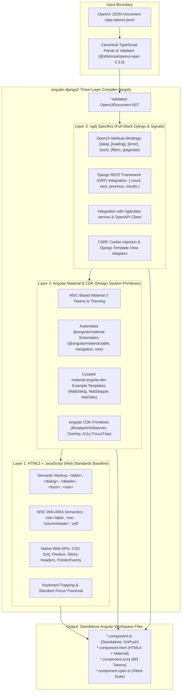

# OpenUI Specification Implementation Plan for `angular-django2` (`ngdj`)

This plan describes how `angular-django2` (`ngdj`) implements the
[OpenUI Specification](https://github.com/shlomoa/openui-spec), version 0.3.0
(`@shlomoa/openui-spec`, pinned in [`package.json`](../package.json)). It
separates what is implemented today from what is planned.

**Status legend**

- **Implemented**: shipped in the schematics collection, with named test
  evidence.
- **Planned**: not implemented. Everything not marked Implemented is Planned.

The per-schematic contract (accepted node types, supported attributes, test IDs,
and known limitations) is maintained in
[`ngdj-openui-spec-mapping.md`](ngdj-openui-spec-mapping.md). This plan links to
it instead of repeating it.

---

## 1. Architecture and Current Boundary

### 1.1 Target architecture: Option A (document-driven, JSON-first compiler)

`angular-django2` is designed as a **document-driven, JSON-first compiler**:

- It consumes concrete OpenUI JSON documents (for example `app.openui.json`) as
  structured input.
- Generation is deterministic: for the same OpenUI document and workspace state,
  it produces identical, verifiable Angular code, without runtime AI
  intervention.

### 1.2 Current boundary (Implemented)

- **Document input is per schematic.** Each schematic that accepts OpenUI input
  takes `--document` (and, for most, `--nodeId`) and compiles one node and its
  subtree: `reactive-form`, `form-field`, `field-component`, `component`,
  `complex-component`, `page`, `application`, `material-app`,
  `workspace-setup`, and `data-service`. `material-setup` and `app-shell` are
  CLI-driven by design. Evidence: the mapping document and the specs under
  `projects/angular-django-validation/unit/schematics/`.
- **No schematic compiles a whole document.** Selecting artifacts and
  orchestrating schematics across a whole application belongs to
  `django-angular3` (`djng`), per the ownership boundary in
  [#27](https://github.com/shlomoa/angular-django2/issues/27).
- **The component widgets in §3 are not implemented.** Documents that contain
  them cannot be compiled yet.

### 1.3 Target constraint: spec-defined identifiers only

> **Target directive**: all object types and attribute contracts that `ngdj`
> consumes and generates must be those defined in `openui-spec`. No
> out-of-spec identifiers may be introduced.

Current status: **partially met**.

- **Object types**: met. Every document is validated by the canonical
  `openui-spec` validator, which rejects types outside the 0.3.0 catalog.
- **Application-scope attributes**: met. The attributes read on `Routing`,
  `Route`, `Navigation`, `NavItem`, `NavGroup`, `ToolBar`, `ToolAction`, `html`,
  and `link` are 0.3.0 catalog attributes.
- **Other attributes**: not met. The 0.3.0 catalog defines no attributes for
  these instance types, so the attributes the schematics read on them are
  repository-local extensions:
  - `Form[title]` and `Form[action]` (`(submit)` is a catalog attribute);
  - `ActionControls[label]`;
  - the control attributes on `TextInputs` and `RangeControl` (`[type]`,
    `[name]`, `[label]`, validation, and appearance attributes);
  - `SurfaceContainers[title]` and `OverlayContainers[label]`;
  - the composition attribute `[slot]`;
  - `DashboardPage` and `EmptyPage` attributes (`[title]`, `[route]`, `[icon]`,
    `[access]`, `[authGuard]`);
  - the `Presentation` tokens (`[theme]`, `[typography]`, `[animations]`);
  - `[data]` (`data-service`) and its `<apiPath>#<ApiService>` value format.

### 1.4 Parser ownership and integration status

- **`openui-spec` owns** the grammar, JSON Schema (`openui.schema.json`),
  vocabulary catalog (`openui.json`), and the TypeScript parser, validator, and
  AST types (`OpenUiJson`, `OpenUiDocument`, `OpenUiElement`). The TypeScript
  package was delivered by
  [openui-spec#135](https://github.com/shlomoa/openui-spec/issues/135)
  (closed).
- **Utility support (Implemented)**: `readOpenUiDocument()` and
  `validateOpenUiDocument()` in `schematics/utility/openui.ts` load documents
  and validate them with the canonical validator, and
  `schematics/utility/ast-compiler.ts` resolves and reads nodes. Tests:
  `schematics.openui.spec.ts` (`TC-OPENUI-01…04`) and `ast-compiler.spec.ts`.
- **Production schematic integration (Implemented)**: the schematics listed in
  §1.2 consume the validated AST. Tests: see the mapping document.
- **Integration history** (all closed or merged):
  - [#98](https://github.com/shlomoa/angular-django2/issues/98): parser and
    validator integration epic.
  - [#101](https://github.com/shlomoa/angular-django2/issues/101): integration
    of the `@shlomoa/openui-spec` npm package.
  - [#103](https://github.com/shlomoa/angular-django2/issues/103): schematics
    pipeline integration.
  - [#104](https://github.com/shlomoa/angular-django2/issues/104): openui-spec
    0.2.0 integration.
  - [#131](https://github.com/shlomoa/angular-django2/pull/131): openui-spec
    0.3.0 integration.
  - [#129](https://github.com/shlomoa/angular-django2/issues/129) /
    [#132](https://github.com/shlomoa/angular-django2/pull/132): `ToolBar`
    compilation.
  - [openui-spec#152](https://github.com/shlomoa/openui-spec/issues/152):
    application routing, navigation, and toolbar contracts (in 0.3.0).

### 1.5 Known limitations of application compilation

These are current behavior, documented by maintainer decision rather than fixed:

- `application --document` does not validate `Navigation` or `Routing` content;
  only `material-app` does.
- Some accepted attributes are validated but not used: `Route[title]`,
  `Route[access]`, `Routing[defaultRoute]`, `Route[redirectTo]`,
  `Navigation[ariaLabel]`, and `NavGroup[expanded]`. `NavGroup` entries are
  flattened, and its `[label]` is not rendered. `page`'s `[icon]` is validated
  but not used.
- Nested `Route` paths are not composed. OpenUI 0.3.0 defines `Route[path]` as
  relative to the parent route, but a link to a child route uses the child's
  path alone.
- `Route[target]` is checked to exist but not to be a page or content element.
- Route paths have two unsynchronized sources: `page` registers
  `DashboardPage[route]`, and `material-app` links to `Route[path]`. Nothing
  checks that they match.

---

## 2. Target Pipeline: Three-Layer Compiler Architecture

This section describes the **target** pipeline. Parts of it exist today (see
the notes after the diagram); the widget scopes in §3 do not.

What exists today:

- **Layers 1 and 2** for the implemented schematics: forms and controls,
  surface and overlay containers, pages, and the Material application layout
  (toolbar, sidenav, router outlet).
- **Layer 3**, in part: `openapi-setup` generates Django CSRF, credential, and
  auth transport helpers; `data-service` generates data services with a DRF
  `results` / `count` response adapter; `page` registers auth guards.
- **Not implemented**: the table attribute bindings (`[data]`, `[loading]`,
  `[error]`, `(sort)`, `(filter)`, `(paginate)`), invoking
  `@angular/material` schematics, and Django template view adapters.

### Layer 1: HTML5 + JavaScript (Web Standards Baseline)

- **Role**: native browser foundation providing standards-compliant semantic
  elements, accessibility, and baseline layout.
- **Key elements**:
  - Semantic HTML tags: `<table>`, `<thead>`, `<tbody>`, `<tr>`, `<th>`, `<td>`,
    `<dialog>`, `
`, `
`, `<nav>`, `<form>`.
  - W3C WAI-ARIA patterns: `role="table"`, `role="row"`,
    `role="columnheader"`, `role="cell"`, `aria-sort`, `aria-expanded`,
    `aria-modal`.
  - Native Web APIs: CSS Grid and Flexbox for structural layout, CSS sticky
    positioning for headers, native keyboard event handling, and focus
    management.

### Layer 2: Angular Material (Design System Primitives & Material 3 Templates)

- **Role**: Material 3 visual styling, component primitives, and CDK behavioral
  plumbing.
- **Acquisition strategies (target)**:
  1. **Automated `ng generate` scaffolding**: where `@angular/material` provides
     official CLI schematics (for example `@angular/material:table`,
     `@angular/material:navigation`, `@angular/material:address-form`), `ngdj`
     runs them through DevKit `externalSchematic` and applies standalone,
     OnPush, and signal post-processing.
  2. **Curated template extraction**: where richer widgets are needed (for
     example `MatDialog` workflows, `MatStepper` wizards, `MatTabs` groups,
     `MatExpansionPanel` panels), canonical Material 3 examples from
     `material.angular.dev` / `@angular/components` are parameterized into
     templates under `projects/angular-django2/schematics/*/templates.ts`.
- **Angular CDK**: `@angular/cdk/layout` (`BreakpointObserver`),
  `@angular/cdk/overlay`, `@angular/cdk/a11y` (`FocusTrap`, `LiveAnnouncer`).

### Layer 3: `ngdj` Specifics (Composites & Django Full-Stack Integration)

- **Role**: binding OpenUI attributes to Angular signals, connecting UI
  components to Django backends, and enforcing standalone `OnPush`
  architectures.
- **Capabilities (target)**:
  - **OpenUI attribute mapping**: binding `[data]`, `[loading]`, `[error]`,
    `(sort)`, `(filter)`, `(paginate)`, and `(selectionChange)` to typed Angular
    signals (`input()`, `output()`, `computed()`).
  - **Django REST Framework (DRF) bridge**: standard DRF pagination responses
    (`{ count: number, next: string | null, previous: string | null, results: T[] }`),
    query parameters (`?limit=20&offset=40` or `?page=2&page_size=20`), and
    ordering parameters (`?ordering=-created_at`).
  - **Data service integration**: direct binding with `ngdj:data-service` to
    consume OpenAPI-generated client endpoints.
  - **Django security and auth**: CSRF cookie header injection (`X-CSRFToken`)
    and auth guard protection.

---

## 3. Scope Implementation Matrix (Planned)

Every row is **Planned**. Scope paths are canonical OpenUI 0.3.0
`<category>/<id>` paths. The schematic names are proposed Angular / Material
names, not OpenUI identifiers; for example, `accordion` does not appear in the
OpenUI catalog, whose scope is `containers/expandablePanels`.

| OpenUI scope                  | Status  | Proposed schematic | Layer 1 building blocks                                                   | Layer 2 building blocks                           | Layer 3 `ngdj` specifics                                                 |
| :---------------------------- | :------ | :----------------- | :------------------------------------------------------------------------ | :------------------------------------------------ | :----------------------------------------------------------------------- |
| `widgets/table`               | Planned | `table`            | `<table>`, `<thead>`, `<tbody>`, `<tr>`, `<th>`, `<td>`, ARIA table roles | `MatTable`, `MatSort`, `MatPaginator`             | DRF pagination adapter, search/filter query sync, `data-service` binding |
| `widgets/dataGrid`            | Planned | `data-grid`        | ARIA grid pattern, keyboard cell navigation                               | CDK Table, virtual scroll                         | Editable cells, multi-select, DRF batch updates                          |
| `widgets/dialog`              | Planned | `dialog`           | Native `<dialog>`, focus trap                                             | `MatDialogModule`, CDK A11y                       | Strongly typed launch service, Django CRUD submit integration            |
| `widgets/stepper`             | Planned | `stepper`          | Form validation events                                                    | `MatStepperModule`, `MatStep`                     | Multi-step `reactive-form` binding, draft state persistence              |
| `containers/tabs`             | Planned | `tabs`             | ARIA tablist/tabpanel                                                     | `MatTabsModule`, CDK Portal                       | Lazy-loaded tab bodies via `embed-component`                             |
| `containers/expandablePanels` | Planned | `accordion`        | `
/
`, ARIA accordion                                     | `MatExpansionModule`                              | Multi/single expand mode, `embed-component` child slots                  |
| `containers/sheetContainers`  | Planned | `bottom-sheet`     | CSS backdrop, touch drag                                                  | `MatBottomSheetModule`, CDK Overlay               | Dismiss gestures, mobile action sheet layout                             |
| `widgets/menuWidgets`         | Planned | `menu`             | ARIA menu/menuitem, keyboard navigation                                   | `MatMenuModule`, `MatMenuTrigger`                 | Context menus, nested cascading menus, route-link integration            |
| `widgets/feedbackWidgets`     | Planned | `feedback`         | Live regions (`aria-live`)                                                | `MatSnackBarModule`, CDK LiveAnnouncer            | Django messages framework adapter, HTTP error interceptor                |
| `widgets/dateTimePickers`     | Planned | `date-picker`      | Native `<input type="date">`                                              | `MatDatepickerModule`, `provideNativeDateAdapter` | Date range support, Django ISO-8601 formatting                           |
| `widgets/chart`               | Planned | `chart`            | SVG primitives, Canvas API                                                | Angular chart adapter (SVG/CDK)                   | DRF aggregation API data binding, responsive resizing                    |

---

## 4. First Focus: `widgets/table` (Planned)

`table` is a single specification concept under `widgets/`. The former
`Controls/Table/` scope was retired; `spec/scopes/Controls/` in 0.3.0 has no
table scope.

### Specification facts (OpenUI v0.3.0)

- **Identity**: scope `id: table`, scope `type: Table`. The instance element is
  `type: table`, with `tr` row children (`tableRow`).
- **Normative attributes**, from
  [`scopes/Widgets/table.scope.md`](https://github.com/shlomoa/openui-spec/blob/v0.3.0/spec/scopes/Widgets/table.scope.md):
  only `(sort)`, `(filter)`, and `(paginate)`, all in the Behaves category.
- **Illustrative only**, from
  [`examples/Widgets/table.example.json`](https://github.com/shlomoa/openui-spec/blob/v0.3.0/spec/examples/Widgets/table.example.json),
  not part of the scope contract:
  - `[data]`, `[selection]`, `[loading]`, `[error]`, and `(selectionChange)` on
    the `table` element;
  - column nodes (typed `Table`) with `[field]`, `[header]`, `[sortable]`,
    `[filterable]`;
  - a pagination node (typed `NavigationWidgets`) with `[pageSize]`, `[total]`,
    `(pageChange)`;
  - an empty-state node (typed `FeedbackWidgets`) with `[message]`.

  `Column`, `Pagination`, and `EmptyState` are not OpenUI types. Before
  `ngdj:table` depends on these attributes, they must become part of the
  `openui-spec` contract (§1.3).

### Three-layer structure of `ngdj:table` (Planned)

1. **Layer 1**: semantic `<table>` with `role="table"`, a responsive horizontal
   scroll container, and a sticky `<th>` header row.
2. **Layer 2**: Angular Material `mat-table` with `MatSortModule`
   (`mat-sort-header`) and `MatPaginatorModule` (`mat-paginator`).
3. **Layer 3**: strongly typed standalone OnPush component wired to
   `ngdj:data-service` and DRF pagination conventions.

---

## 5. Roadmap

### Completed (Implemented)

- [x] Consume the canonical TypeScript parser, validator, and AST types from
      `@shlomoa/openui-spec` (§1.4).
- [x] Compile OpenUI nodes in the existing schematics (§1.2). Contracts and
      test IDs: [`ngdj-openui-spec-mapping.md`](ngdj-openui-spec-mapping.md).
- [x] Integrate openui-spec 0.3.0, including `Routing` / `Navigation`
      compilation in `material-app`
      ([#131](https://github.com/shlomoa/angular-django2/pull/131)).
- [x] Compile `ToolBar` content
      ([#129](https://github.com/shlomoa/angular-django2/issues/129),
      [#132](https://github.com/shlomoa/angular-django2/pull/132); tests
      `TC-APP-15…17` in `schematics.openui-app.spec.ts`).

### Planned

None of these items has a tracking issue yet.

- **Data presentation and dialogs**:
  - [ ] `table` (`widgets/table`)
  - [ ] `dialog` (`widgets/dialog`)
  - [ ] `stepper` (`widgets/stepper`)
- **Containers and navigation**:
  - [ ] `tabs` (`containers/tabs`)
  - [ ] `accordion` (`containers/expandablePanels`)
  - [ ] `menu` (`widgets/menuWidgets`)
  - [ ] `bottom-sheet` (`containers/sheetContainers`)
- **Pickers, feedback, and specialized widgets**:
  - [ ] `date-picker` (`widgets/dateTimePickers`)
  - [ ] `feedback` (`widgets/feedbackWidgets`)
  - [ ] `data-grid` (`widgets/dataGrid`)
  - [ ] `chart` (`widgets/chart`)
- **For each new schematic**:
  - [ ] Vitest unit tests in `projects/angular-django-validation/unit/schematics/`.
  - [ ] A demonstration page in `projects/angular-django2-reference`.
  - [ ] A mapping entry in [`ngdj-openui-spec-mapping.md`](ngdj-openui-spec-mapping.md).
  - [ ] Passing `npm run test:node` and `npm run test:e2e`.
