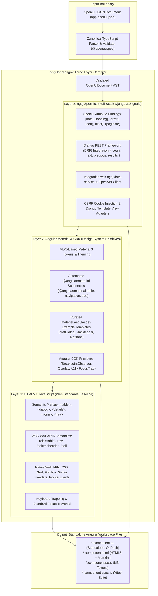

# OpenUI Specification Implementation Plan for `angular-django2` (`ngdj`)

## 1. Overview and Architectural Purpose

`ngdj` (`angular-django2`) provides an Angular CLI schematics collection for Django-backed applications. This plan establishes the architectural roadmap to bring `ngdj` to full compliance with the [OpenUI Specification](https://github.com/shlomoa/openui-spec).

### 1.1 Foundational Architecture Decision: Option A (Document-Driven JSON-First Compiler)
`angular-django2` operates as a **document-driven, JSON-first compiler**:
- It consumes concrete OpenUI JSON documents (`input.json`, `app.openui.json`, or component definitions) as its structured input.
- Generation is deterministic: for the same OpenUI document and workspace state, `ngdj` produces identical, verifiable Angular code without runtime AI intervention.

### 1.2 Core Constraint: Spec-Defined Selectors Only
> **Normative Directive**: All selectors, component identifiers, object types, and attribute contracts used and generated by `ngdj` under this plan must be strictly those formally defined in `openui-spec`. No out-of-spec selectors or custom behavioral identifiers may be introduced.

### 1.3 Parser Ownership and Specification Boundary
- **`openui-spec` Authority**: `openui-spec` owns the specification grammar, JSON Schema (`openui.schema.json`), vocabulary catalog (`openui.json`), and the mandatory version bump policy on `SCHEMA_VERSION`. To maintain a single source of truth (SSOT) and eliminate parser drift, `openui-spec` exports the canonical TypeScript parser, validator, and AST types (`OpenUiDocument`, `OpenUiElement`) (tracked in [openui-spec#135](https://github.com/shlomoa/openui-spec/issues/135)).
- **`angular-django2` Transformation Role**: `angular-django2` consumes the validated `OpenUiDocument` AST from the canonical parser and compiles it through its Three-Layer transformation pipeline into Angular workspace files (integration of the upstream package is tracked in [#98](https://github.com/shlomoa/angular-django2/issues/98)).

---

## 2. The Three-Layer Compiler Architecture

Each OpenUI element in the AST is compiled into Angular files by synthesizing three distinct layers:

### Layer 1: HTML5 + JavaScript (Web Standards Baseline)
- **Role**: Native browser foundation providing standards-compliant semantic elements, accessibility, and baseline layout.
- **Key Elements**:
  - Semantic HTML tags: `<table>`, `<thead>`, `<tbody>`, `<tr>`, `<th>`, `<td>`, `<dialog>`, `
`, `
`, `<nav>`, `<form>`.
  - W3C WAI-ARIA patterns: `role="table"`, `role="row"`, `role="columnheader"`, `role="cell"`, `aria-sort`, `aria-expanded`, `aria-modal`.
  - Native Web APIs: CSS Grid and Flexbox for structural layout, CSS sticky positioning for headers, native keyboard event handling, and focus management.

### Layer 2: Angular Material (Design System Primitives & Material 3 Templates)
- **Role**: Material 3 visual styling, component primitives, and CDK behavioral plumbing.
- **Acquisition Strategies**:
  1. **Automated `ng generate` Scaffolding**: Where `@angular/material` provides official CLI schematics (e.g. `@angular/material:table`, `@angular/material:navigation`, `@angular/material:address-form`), `ngdj` executes them programmatically via DevKit `externalSchematic` and applies standalone/OnPush/Signal post-processing.
  2. **Curated Template Extraction**: Where richer widgets are needed (e.g. `MatDialog` workflows, `MatStepper` wizards, `MatTabs` groups, `MatExpansionPanel` accordions), canonical MDC Material 3 examples are extracted from `material.angular.dev` / `@angular/components`, parameterized into EJS templates, and managed within `projects/angular-django2/schematics/*/templates.ts`.
- **Angular CDK**: `@angular/cdk/layout` (`BreakpointObserver`), `@angular/cdk/overlay`, `@angular/cdk/a11y` (`FocusTrap`, `LiveAnnouncer`).

### Layer 3: `ngdj` Specifics (Composites & Django Full-Stack Integration)
- **Role**: Binding OpenUI specification attributes to Angular signals, connecting UI components to Django backends, and enforcing standalone `OnPush` architectures.
- **Capabilities**:
  - **OpenUI Attribute Mapping**: Binding `[data]`, `[loading]`, `[error]`, `(sort)`, `(filter)`, `(paginate)`, `(selectionChange)` to typed Angular Signals (`input()`, `output()`, `computed()`).
  - **Django REST Framework (DRF) Bridge**: Out-of-the-box support for standard DRF pagination responses (`{ count: number, next: string | null, previous: string | null, results: T[] }`), query parameters (`?limit=20&offset=40` or `?page=2&page_size=20`), and ordering parameters (`?ordering=-created_at`).
  - **Data Service Integration**: Direct binding with `ngdj:data-service` to consume OpenAPI-generated client endpoints.
  - **Django Security & Auth**: CSRF cookie header injection (`X-CSRFToken`) and auth guard protection.

---

## 3. Scope Implementation Matrix

All target components map directly to the canonical contracts in `openui-spec`:

| OpenUI Spec Scope | Target `ngdj` Schematic | Layer 1 Building Blocks | Layer 2 Building Blocks | Layer 3 `ngdj` Specifics |
| :--- | :--- | :--- | :--- | :--- |
| **`Widgets/table`** (`id: table`) | `table` | `<table>`, `<thead>`, `<tbody>`, `<tr>`, `<th>`, `<td>`, ARIA table roles | `MatTable`, `MatSort`, `MatPaginator` | DRF pagination adapter, search/filter query sync, `data-service` binding |
| **`Widgets/data_grid`** (`id: dataGrid`) | `data-grid` | ARIA grid pattern, keyboard cell navigation | CDK Table, virtual scroll | Editable cells, multi-select, DRF batch updates |
| **`Widgets/dialog`** (`id: dialog`) | `dialog` | Native `<dialog>`, focus trap | `MatDialogModule`, CDK A11y | Strongly-typed launch service, Django CRUD submit integration |
| **`Widgets/stepper`** (`id: stepper`) | `stepper` | Form validation events | `MatStepperModule`, `MatStep` | Multi-step `reactive-form` binding, draft state persistence |
| **`Containers/tabs`** (`id: tabs`) | `tabs` | ARIA tablist/tabpanel | `MatTabsModule`, CDK Portal | Lazy-loaded tab bodies via `embed-component` |
| **`Containers/expandable_panels`** | `accordion` | `
/
`, ARIA accordion | `MatExpansionModule` | Multi/single expand mode, `embed-component` child slots |
| **`Containers/sheet_containers`** | `bottom-sheet` | CSS backdrop, touch drag | `MatBottomSheetModule`, CDK Overlay | Dismiss gestures, mobile action sheet layout |
| **`Widgets/menu_widgets`** | `menu` | ARIA menu/menuitem, keyboard nav | `MatMenuModule`, `MatMenuTrigger` | Context menus, nested cascading menus, route-link integration |
| **`Widgets/feedback_widgets`** | `feedback` | Live regions (`aria-live`) | `MatSnackBarModule`, CDK LiveAnnouncer | Django messages framework adapter, HTTP error interceptor |
| **`Controls/date_time_pickers`** | `date-picker` | Native `<input type="date">` | `MatDatepickerModule`, `provideNativeDateAdapter` | Date range support, Django ISO-8601 formatting |
| **`Widgets/charts`** | `chart` | SVG primitives, Canvas API | Angular chart adapter (SVG/CDK) | DRF aggregation API data binding, responsive resizing |

---

## 4. First Focus: Unified `table` Implementation

Following the resolution of the OpenUI specification defect (where `Controls/Table/` was retired in favor of `Widgets/table.scope.md`), `table` is treated as a single, unified specification concept.

### Specification Alignment (`Widgets/table.scope.md` & `table.example.json`)
- **Identity**: `id: table`, `type: table`.
- **Attributes**:
  - `[data]`: Array of typed row items.
  - `[loading]`: Boolean signal indicating ongoing network fetch.
  - `[error]`: Error state / message signal.
  - `(sort)`: Column ordering event emitting active column and direction.
  - `(filter)`: Filter predicate event.
  - `(paginate)`: Page change event emitting page index and page size.
  - `(selectionChange)`: Selection event emitting selected row(s).
- **Child Model**:
  - `Column`: `[field]`, `[header]`, `[sortable]`, `[filterable]`.
  - `Pagination`: `[pageSize]`, `[total]`, `(pageChange)`.
  - `EmptyState`: `[message]`.

### Three-Layer Structure of `ngdj:table`
1. **Layer 1**: Semantic `<table>` with `role="table"`, responsive horizontal scroll container, and sticky `<th>` header row.
2. **Layer 2**: Angular Material `mat-table` with `MatSortModule` (`mat-sort-header`) and `MatPaginatorModule` (`mat-paginator`).
3. **Layer 3**: Strongly-typed standalone OnPush component wired to `ngdj:data-service` and DRF pagination conventions.

---

## 5. Phased Implementation Roadmap

### Phase 1: High-Priority Data Presentation & Dialog Scopes
- [ ] Ingest/consume canonical OpenUI TypeScript AST types from `openui-spec`.
- [ ] Implement `ng generate angular-django2:table` schematic conforming to `Widgets/table.scope.md`.
- [ ] Implement `ng generate angular-django2:dialog` schematic conforming to `Widgets/dialog.scope.md`.
- [ ] Implement `ng generate angular-django2:stepper` schematic conforming to `Widgets/stepper.scope.md`.
- [ ] Add comprehensive Vitest unit tests in `tests/schematics/`.

### Phase 2: Container & Navigation Scopes
- [ ] Implement `tabs` (`Containers/tabs.scope.md`) and `accordion` (`Containers/expandable_panels.scope.md`).
- [ ] Implement `menu` (`Widgets/menu_widgets.scope.md`).
- [ ] Implement `bottom-sheet` (`Containers/sheet_containers.scope.md`).

### Phase 3: Pickers, Feedback & Specialized Controls
- [ ] Implement `date-picker` (`Controls/date_time_pickers.scope.md`).
- [ ] Implement `feedback` (`Widgets/feedback_widgets.scope.md`).
- [ ] Implement `data-grid` (`Widgets/data_grid.scope.md`).
- [ ] Implement `chart` (`Widgets/charts.scope.md`).

### Phase 4: Reference App Showcase and Documentation
- [ ] Add interactive live demonstration pages for each new component in `projects/angular-django2-reference`.
- [ ] Update `docs/ngdj-openui-spec-mapping.md` to show 100% active functional mappings.
- [ ] Validate end-to-end schematic execution via `npm run test:e2e` and `npm run test:node`.
